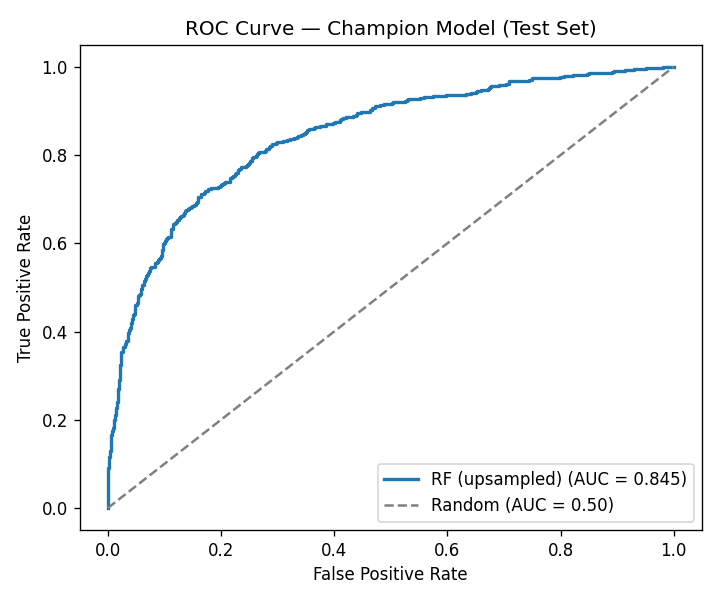
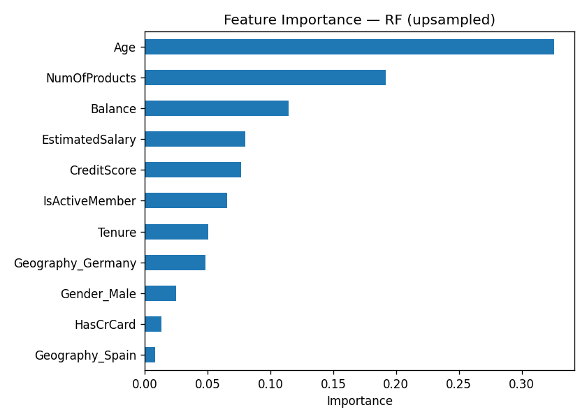

# Bank Customer Churn Prediction

Predicts which bank customers are likely to churn, with an emphasis on the metrics that
actually matter on imbalanced data — **F1 and recall on churners, not raw accuracy**.

## Results — held-out test set

**Champion model: Random Forest with minority-class upsampling** (n_estimators=20, max_depth=10)

| Metric | Score |
|---|---|
| F1 | **0.619** |
| Accuracy | 0.833 |
| ROC AUC | **0.845** |
| Recall (churners) | 0.64 |
| Precision (churners) | 0.60 |

Top churn drivers (feature importance): **Age, NumOfProducts, Balance**.




## Why F1 and recall, not accuracy
The target is ~80/20 (stayed/churned). A model that always predicts "stayed" scores ~80%
accuracy with **zero** ability to catch churners — so accuracy is misleading here. F1 (and
recall on the churn class) is the right objective.

## Approach
1. **Data prep** — drop identifier columns, median-fill missing Tenure, one-hot encode
   Geography/Gender, and scale numeric features with `StandardScaler` **fit on the training
   split only** to prevent leakage.
2. **Split** — 60% train / 20% validation / 20% test.
3. **Baselines** — Decision Tree, Random Forest, Logistic Regression, no imbalance handling.
4. **Imbalance correction (training set only)** — class weighting, upsampling, downsampling.
5. **Selection** — tune on validation F1, then evaluate the top model from each approach on the
   held-out test set for an unbiased final comparison.

## Run it
```bash
pip install -r requirements.txt
jupyter notebook churn_prediction.ipynb
```
The dataset (`Churn.csv`, 10,000 rows) is included; the notebook loads it via a relative path,
so the project runs as-is after cloning.

## Files
- `churn_prediction.ipynb` — full analysis with committed outputs
- `Churn.csv` — dataset
- `roc_curve.png`, `feature_importance.png` — exported figures
- `requirements.txt` — dependencies
